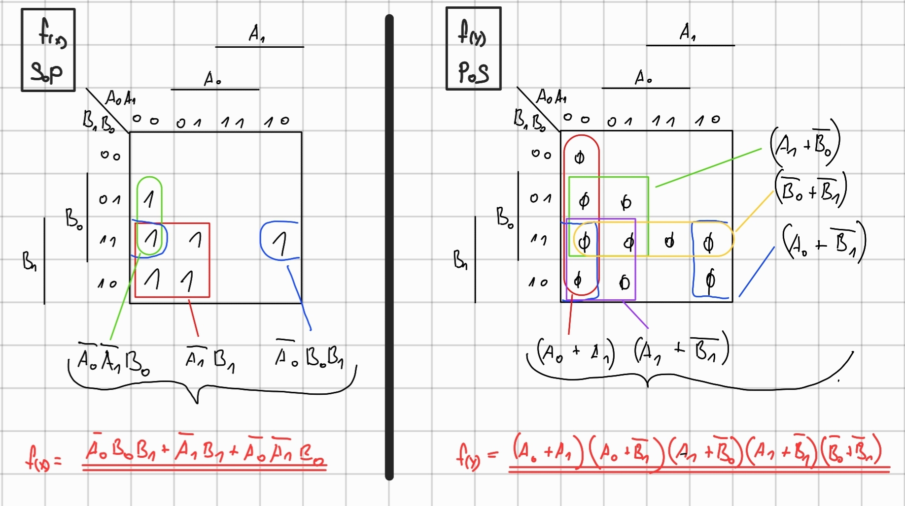
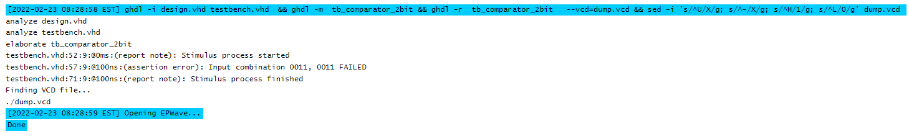

# Lab 2: Karel Beranek

### 2-bit comparator

1. Karnaugh maps for other two functions:
  +
2. Equations of simplified SoP (Sum of the Products) form of the "greater than" function and simplified PoS (Product of the Sums) form of the "less than" function.
   Greater than:

   


### 4-bit comparator

1. Listing of VHDL stimulus process from testbench file (`testbench.vhd`) with at least one assert (use BCD codes of your student ID digits as input combinations). Always use syntax highlighting, meaningful comments, and follow VHDL guidelines:

   Last two digits of my student ID: **73**
   
   | **Number** | **BCD code** |
   | :-: | :-: |
   |  3 | 0011 |
   |  3 | 0011 |

   ```vhdl
       p_stimulus : process
      begin
         -- Report a note at the beginning of stimulus process
         report "Stimulus process started" severity note;

         --Second test case
	     s_b <= "0011"; --last two digits of my ID - B si greater then A
         s_a <= "0011";
         wait for 100 ns;
         -- Expected output
         assert ((s_B_greater_A = '1') and
                (s_B_equals_A  = '0') and
                (s_B_less_A    = '0'))
        -- If false, then report an error
        report "Input combination 0011, 0011 FAILED" severity error;

        -- Report a note at the end of stimulus process
        report "Stimulus process finished" severity note;
        wait;
    end process p_stimulus;
   ```

2. Text console screenshot during your simulation, including reports.

   Signals of 4bit comparator:
   


3. Link to your public EDA Playground example:

   [https://www.edaplayground.com/x/Mn92](https://www.edaplayground.com/x/Mn92)
   
## References

1. Tomas Fryza. [digital-electronics-1 [Lab 2: Combinational logic]](https://github.com/tomas-fryza/digital-electronics-1/tree/master/labs/02-logic#readme)
