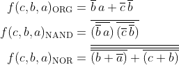
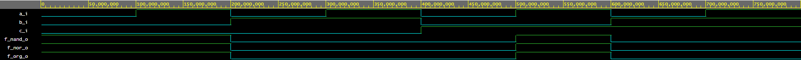
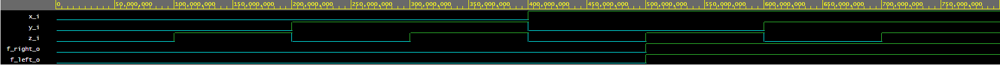

# Lab 1: Karel Beranek

### De Morgan's laws

1. Equations of all three versions of logic function f(c,b,a):

   

2. Listing of VHDL architecture from design file (`code/design.vhd`) for all three functions.

   ```vhdl
   architecture dataflow of gates is
   begin
      f_org_o  <= (not(b_i) and a_i) or (not(c_i) and not(b_i));
      f_nand_o <= (((b_i nand b_i)nand a_i)nand((b_i nand b_i)nand (c_i nand c_i)));  -- MODIFY THIS FUNCTION
      f_nor_o  <= ((( c_i nor c_i)nor a_i) nor b_i);                                  -- MODIFY THIS FUNCTION
   end architecture dataflow;

   ```

3. Table with logic functions' values:

   | **c** | **b** |**a** | **f(c,b,a)_ORG** | **f(c,b,a)_NAND** | **f(c,b,a)_NOR** |
   | :-: | :-: | :-: | :-: | :-: | :-: |
   | 0 | 0 | 0 | 1 | 1 | 1 |
   | 0 | 0 | 1 | 1 | 1 | 1 |
   | 0 | 1 | 0 | 0 | 0 | 0 |
   | 0 | 1 | 1 | 0 | 0 | 0 |
   | 1 | 0 | 0 | 0 | 0 | 0 | 
   | 1 | 0 | 1 | 1 | 1 | 1 |
   | 1 | 1 | 0 | 0 | 0 | 0 |
   | 1 | 1 | 1 | 0 | 0 | 0 |

4. Screenshot with simulated time waveforms.

   
   (click to open picture in new tab)
   
3. Link to public EDA Playground example:

   [EDA Playgroud project - basic gates](https://www.edaplayground.com/x/vnvJ)
   
### Distributive laws
1. Equations

   
   
2. Screenshot with simulated time waveforms.
   
      
      
      (click to open picture in new tab)
      ```vhdl
      architecture dataflow of gates is
      begin
            f_left_o  <= (x_i and y_i) or (x_i and z_i);
            f_right_o <= (x_i) and (y_i or z_i);
      end architecture dataflow;
      ```

3. Link to public EDA Playground example:
   
   [EDA Playgroud project - distributive laws](https://www.edaplayground.com/x/anrD)
