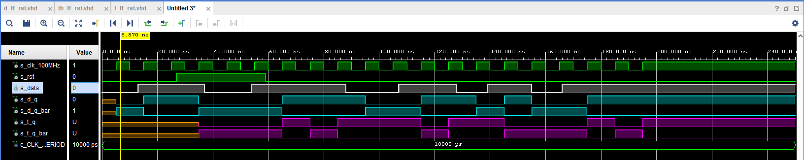

# Lab 5: Karel Beránek

### Flip-flops

1. Listing of VHDL architecture for T-type flip-flop. Always use syntax highlighting, meaningful comments, and follow VHDL guidelines:

```vhdl
library IEEE;
use IEEE.STD_LOGIC_1164.ALL;

entity t_ff_rst is
    Port ( clk : in STD_LOGIC;
           rst : in STD_LOGIC;
           t : in STD_LOGIC;
           q : out STD_LOGIC;
           q_bar : out STD_LOGIC);
end t_ff_rst;

architecture Behavioral of t_ff_rst is
    signal s_q : std_logic;
begin

    p_t_ff_rst : process(clk)
    begin
        if rising_edge(clk) then


            if (rst = '1' ) then
                s_q     <= '0';
            else
                -- s_q     <= ( (t and (not s_q)) or ((not t) and s_q) );
                s_q <= t xor s_q; -- predchozi radek je definici funkce xor
            end if;
            
        end if;
    end process p_t_ff_rst;

    -- Output ports are permanently connected to local signal
    q     <= s_q;
    q_bar <= not s_q;
end architecture Behavioral;
```

2. Screenshot with simulated time waveforms. Try to simulate both flip-flops in a single testbench with a maximum duration of 200 ns, including reset. Always display all inputs and outputs (display the inputs at the top of the image, the outputs below them) at the appropriate time scale!

   

### Shift register

1. Image of the shift register `top` level schematic. The image can be drawn on a computer or by hand. Always name all inputs, outputs, components and internal signals!

   
