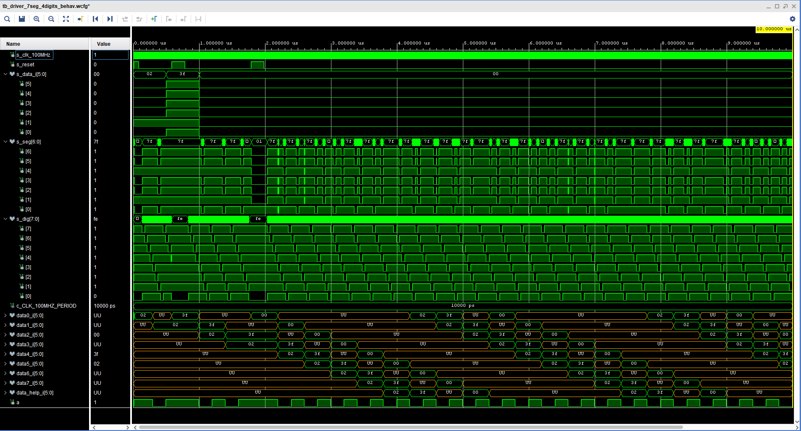
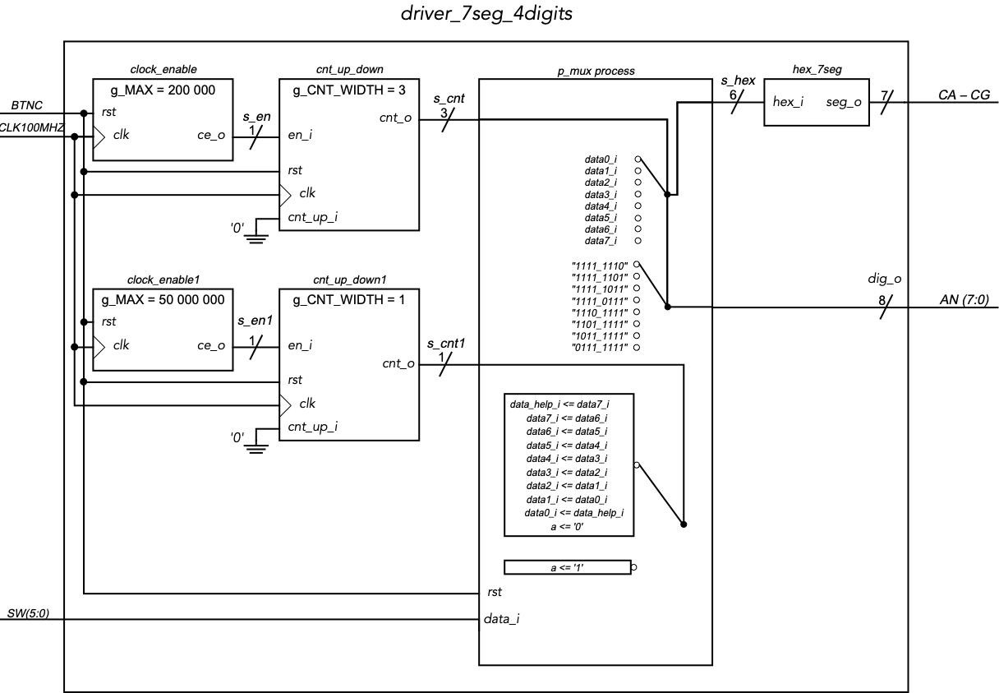
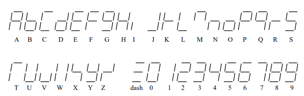

# RUNNING TEXT ON 7-SEG DISPLAYS 


### Team members

* Karel Beránek
* Filip Kounický
* Honza Bukovský
* Marian Dvořáček

#### Základ pro oba projekty (Karel Beránek, Filip Kounický, Honza Bukovský, Marian Dvořáček)
#### TestBench pro abecedu (Honza Bukovský)
#### Schéma (Filip Kounický)
#### Ostatní TestBenche (Karel Beránek, Filip Kounický, Honza Bukovský)
#### Řešení 1 (Karel Beránek, Filip Kounický, Honza Bukovský)
#### Řešení 2 (Marian Dvořáček)
#### Prezentace (Karel Beránek, Filip Kounický, Honza Bukovský, Marian Dvořáček)
#### Dokumentace GitHub (Karel Beránek)

### Table of contents

* [Project objectives](#objectives)
* [Hardware description](#hardware)
* [VHDL modules description and simulations](#modules)
* [TOP module description and simulations](#top)
* [Video](#video)
* [References](#references)

<a name="objectives"></a>

## Project objectives

Měli jsme úkol rozběhat text na 7-segmentovém displeji. Naše práce došla k závěru dvou řešení, 
* první řešení: (vztahují se všechny testbenche apod.) Ovládání je řešeno pomocí switche 0 - 5 (6-bit) a jedno tlačítko reset. Pokud podržíme tlačítko reset, tak se nám stopne běh programu a můžeme pozorovat na segmentu 0 volené ASCII znaky pomocí šesti přepínačů (abecedu a čísla), poté co pustíme tlačítko reset tak vidíme jak se nám navolený znak pohybuje do leva. Vždy můžeme editovat pouze segment 0.
* druhé řešení: (pokročilejší než první) Ovládání je řešeno pomocí: switche 0 - 5 (6-bit), 9 (reset), 13 (programovaní pomocí přepínačů), 14 (programovaní pomocí tlačítek nahoru & dolů za předpokladu že je přepínač zapnut), 15 (STOP & GO) a pomocí všech pěti tlačítek. Po zapnutí desky se nám spustí program s defaultním textem (který lze později editovat). Text se edituje stejným způsubem jako u prvního řešení nebo pomocí switche 14. Když se stane, že budeme mí sepnuty přepínače 13 & 14 tak má vyšší prioritu přepínač 13. Rychlost měníme pomocí tlačítek nahoru a dolů. Vždy můžeme editovat pouze segment 0.

<a name="hardware"></a>

## Hardware description

U obou verzí používáme pouze desku: XYLINX NEXYS A7 (ARTIX-7 50T)

<a name="modules"></a>

## VHDL modules description and simulations

Převážná část modulů byla použita z již dříve absolvovaných cvičeních.

Simulace upravených modulů:
### Finální simulace


### Simulace pro symboly
.png)

### Schéma prvního řešení


### Výpis z konzole


[Kompletní výpis z konzole](vypis.txt)

### Abeceda pro 7-segmentový displej
(společná po obě řešení)



<a name="top"></a>

## TOP module description and simulations


```vhdl
end architecture Behavioral;

    p_mux : process(clk)
    begin
        if rising_edge(clk) then
            if (reset = '1') then
                data0_i <= data_i;
                s_hex <= data0_i;
                dig_o <= "11111110";
            else
                case s_cnt is
                    when "111" =>
                        s_hex <= data7_i;
                        dig_o <= "01111111";

                    when "110" =>
                        s_hex <= data6_i;
                        dig_o <= "10111111";

                    when "101" =>
                       s_hex <= data5_i;
                       dig_o <= "11011111";
                       
                    when "100" =>
                        s_hex <= data4_i;
                        dig_o <= "11101111";

                    when "011" =>
                        s_hex <= data3_i;
                        dig_o <= "11110111";

                    when "010" =>
                       s_hex <= data2_i;
                       dig_o <= "11111011";

                    when "001" =>
                        s_hex <= data1_i;
                        dig_o <= "11111101";

                    when others =>
                        s_hex <= data0_i;
                        dig_o <= "11111110";
                end case;
                
                case s_cnt1 is
                    when "1" =>
                    if (a='1') then
                       data_help_i <= data7_i;
                       data7_i <= data6_i;
                       data6_i <= data5_i;
                       data5_i <= data4_i;
                       data4_i <= data3_i;
                       data3_i <= data2_i;
                       data2_i <= data1_i;
                       data1_i <= data0_i;
                       data0_i <= data_help_i;
                       a <= '0';
                    end if;

                    when others =>
                       a <= '1';                      
                end case; 
                
            end if;
        end if;
    end process p_mux;

```


<a name="video"></a>

## Videos

Pro přehraní videa je nutné se přihlásit pomocí fakultního účtu typu "xxxx00@vutbr.cz

[Úvodní video](https://drive.google.com/file/d/1-LChVKkGhKZEPk7eCUmlcEoUhYBx0-dx/view?usp=sharing)

[Pokračování UV](https://drive.google.com/file/d/1-O4ApQPPwvTY1AVCqF3fFxzsLIKYnDrD/view?usp=sharing)

[Schéma prvního řešení](https://drive.google.com/file/d/1-8eZ3m0fxgZPiXu0mg25xYZDpbvsBzfI/view?usp=sharing)

[Prezentace prvního řešení](https://drive.google.com/file/d/1-6MO5--xOwYgJWC3FrRB-GvysRRTKJ96/view?usp=sharing)

[Prezentace druhého řešení 1/2](https://drive.google.com/file/d/1-9oV91fKzjT1_Yi1m0T_N84viRxAm2VW/view?usp=sharing)

[Prezentace druhého řešení 2/2](https://drive.google.com/file/d/1-IdiSv18BQvJziKw8wlxH7499bNzLLxV/view?usp=sharing)

<a name="references"></a>

## References

[GitHub Tomáše Frýzy](https://github.com/tomas-fryza/digital-electronics-1)

[Abeceda pro 7-segmentový displej](https://www.google.com/url?sa=i&url=https%3A%2F%2Fwww.avrfreaks.net%2Fforum%2Fatmel-studio-7-7-segment-display-code-help&psig=AOvVaw13xJjc6fvRvp7L_0X9eaH4&ust=1651752406772000&source=images&cd=vfe&ved=0CAkQjRxqFwoTCKj3ka3nxfcCFQAAAAAdAAAAABAE)
